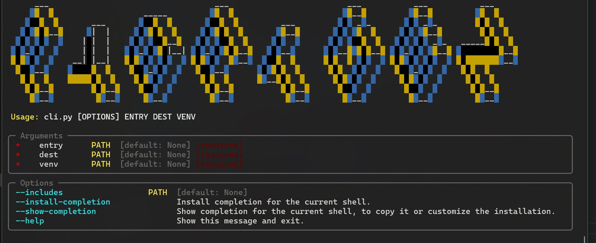

========
PyBatGen
========

.. image:: https://img.shields.io/pypi/v/pybatgen.svg
        :target: https://pypi.python.org/pypi/pybatgen

.. image:: https://img.shields.io/travis/reedjones/pybatgen.svg
        :target: https://travis-ci.com/reedjones/pybatgen

.. image:: https://readthedocs.org/projects/pybatgen/badge/?version=latest
        :target: https://pybatgen.readthedocs.io/en/latest/?version=latest
        :alt: Documentation Status

Generate .bat files for python scripts/modules

* Free software: MIT license
* Documentation: https://pybatgen.readthedocs.io.

Overview
--------

**PyBatGen** is a CLI tool designed to automate the creation of `.bat` scripts for Python programs. With PyBatGen, you can easily generate batch scripts that execute your Python scripts/modules, making it simpler to run them on Windows systems. It also allows you to manage dependencies and virtual environments seamlessly.

Features
--------

- Generates `.bat` files for Python script(s) and places them on PATH.
- Optionally specify virtual environment (venv), additional directories to include, and destination folder.
- Ensures the created scripts are compatible with the current Python environment.

Installation
------------

You can install PyBatGen using pip:

.. code:: bash

    pip install pybatgen

Usage
-----

Basic usage of PyBatGen is straightforward. Here's how you can generate a `.bat` script for your Python entry file:

.. code:: bash

    pybatgen path/to/entry_script.py

You can also specify additional directories to include, a custom destination folder, and a virtual environment:

.. code:: bash

    pybatgen path/to/entry_script.py --include-dir path/to/dir1 --include-dir path/to/dir2 --dest path/to/destination --venv path/to/venv

Examples
--------

1. Generate a `.bat` script for a simple Python script:

    .. code:: bash

        pybatgen my_script.py

2. Generate a `.bat` script with additional directories included:

    .. code:: bash

        pybatgen my_script.py --include-dir lib --include-dir utils

3. Specify a custom destination for the generated `.bat` script:

    .. code:: bash

        pybatgen my_script.py --dest C:/custom/path

4. Use a virtual environment:

    .. code:: bash

        pybatgen my_script.py --venv C:/path/to/venv

License
-------

This project is licensed under the MIT License - see the LICENSE file for details.

Contributing
------------

We welcome contributions! Please see our contributing guidelines for details on how to get started.

* Documentation: https://pybatgen.readthedocs.io.

TODO
----

- Add more customization options for `.bat` script generation.
- Enhance error handling and user feedback.
- Implement support for more complex project structures.

Credits
-------

This package was created with Cookiecutter_ and the `audreyr/cookiecutter-pypackage`_ project template.

.. _Cookiecutter: https://github.com/audreyr/cookiecutter
.. _`audreyr/cookiecutter-pypackage`: https://github.com/audreyr/cookiecutter-pypackage
